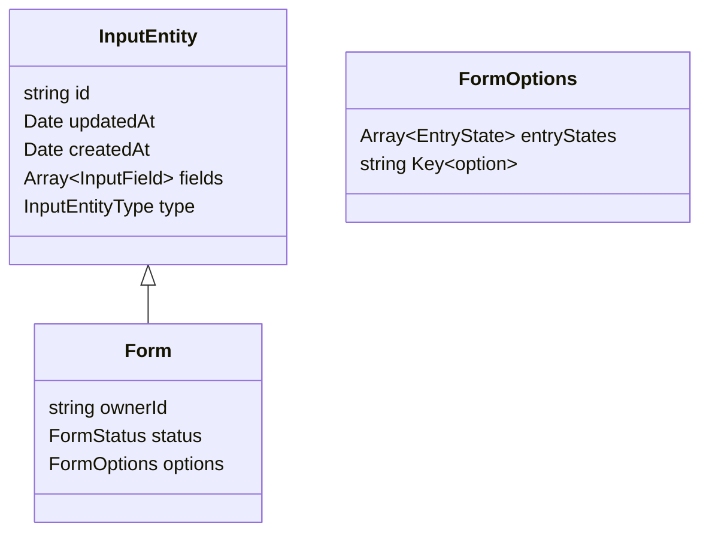

# Form-Field-Output Class Diagrams

```mermaid

classDiagram
  class InputEntity {
    string id
    Date updatedAt
    Date createdAt
    Array~InputField~ fields
    InputEntityType type
  }


  InputEntity <|-- Form
  class Form {
    string ownerId
    FormStatus status
    FormOptions options
  }

  class FormOptions {
    Array~EntryState~ entryStates
    string Key~option~
  }


```
