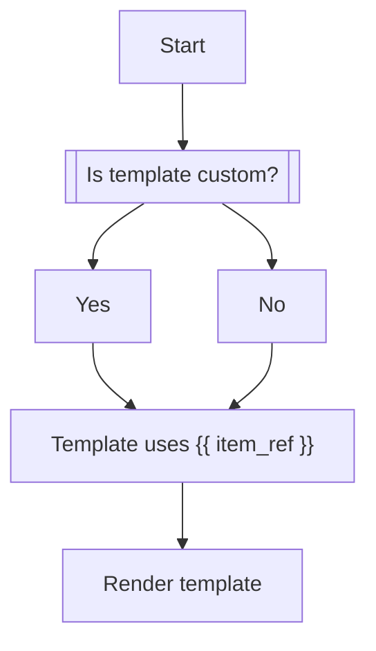

# PDF Templating



## Example templates

### Text template (Default)

```handlebars
<span>
  {{ item_ref }}
</span>
```

### Text template (Custom)

```handlebars
<span style="text-align: center;">
  {{ item_ref }}
</span>
```
