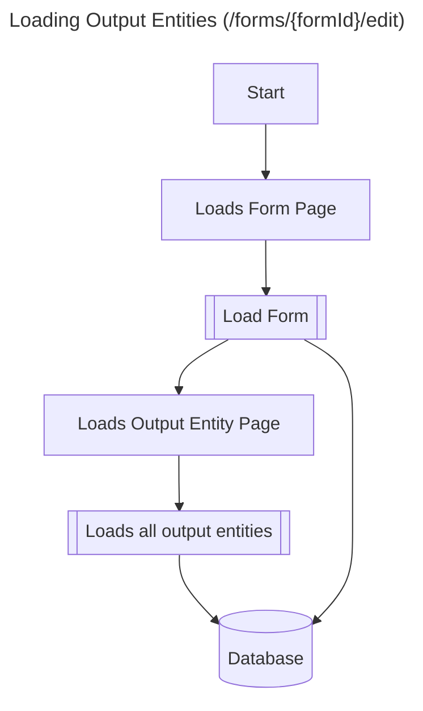
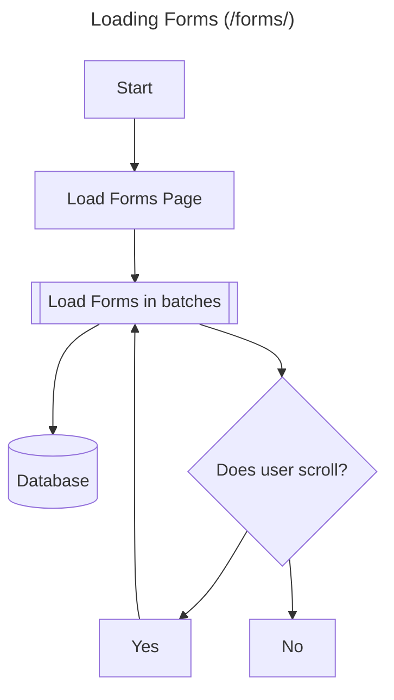
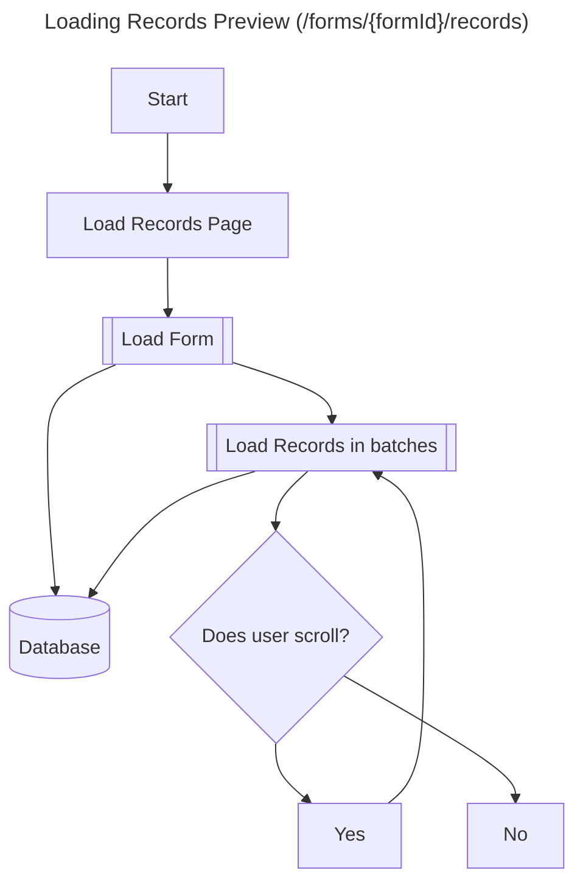
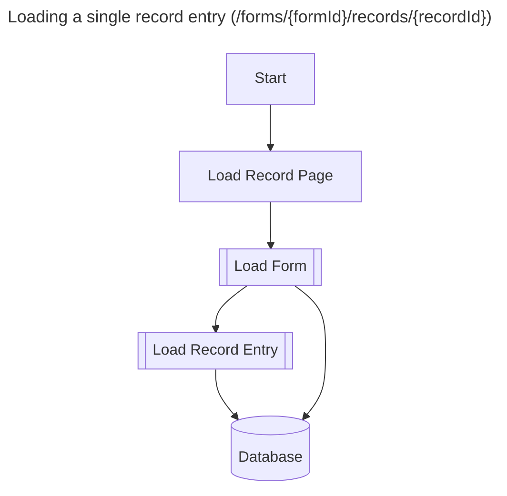

# Form - Field - Output DB Access Flowchart

```mermaid
---
title: Loading Output Entities (/forms/{formId}/edit)
---
flowchart TD
  db[(Database)]

  A[Start] --> B[Loads Form Page]

  B --> C[[Load Form]] --> D[Loads Output Entity Page] --> E[[Loads all output entities]] --> db

  C --> db
```

---

```mermaid

---
title: Loading Forms (/forms/)
---
flowchart TD
  db[(Database)]

  A[Start] --> B[Load Forms Page]

  B --> C[[Load Forms in batches]] --> db

  C --> D{Does user scroll?}

  D --> Yes --> C
  D --> No
```

---

```mermaid
---
title: Loading Records Preview (/forms/{formId}/records)
---
flowchart TD
  db[(Database)]

  A[Start] --> B[Load Records Page]

  B --> C[[Load Form]] --> db

  C --> D[[Load Records in batches]] --> db

  D --> E{Does user scroll?}

  E --> Yes --> D
  E --> No
```

---

```mermaid
---
title: Loading a single record entry (/forms/{formId}/records/{recordId})
---
flowchart TD
  db[(Database)]

  A[Start] --> B[Load Record Page]
  B --> C[[Load Form]] --> D[[Load Record Entry]] --> db
  C --> db
```
