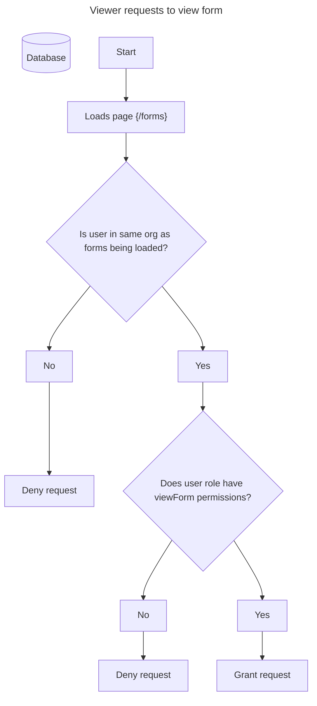

# Roles & Permissions



Access pattern

```raw
function isUserAuthenticated() {
  return request.auth != null
}

function isUserInResourceOrg() {
  let userOrg = get(/databases/$(database)/documents/users/$(request.auth.uid)).userDoc.data.org;
  return userOrg == resource.data.org;
}

function doesUserRoleHaveViewFormPermissions() {
  let userRole = get(/databases/$(database)/documents/users/$(request.auth.uid)).userDoc.data.role;
  let rolePermissions = get(/databases/$(database)/documents/$(userRole)).data.permissions
  return "viewer" in rolePermissions;
}

match /forms/{formId} {
  allow read: if isUserAuthenticated() && isUserInResourceOrg() && doesUserRoleHaveViewFormPermissions();
  allow write: if null;
}
```
