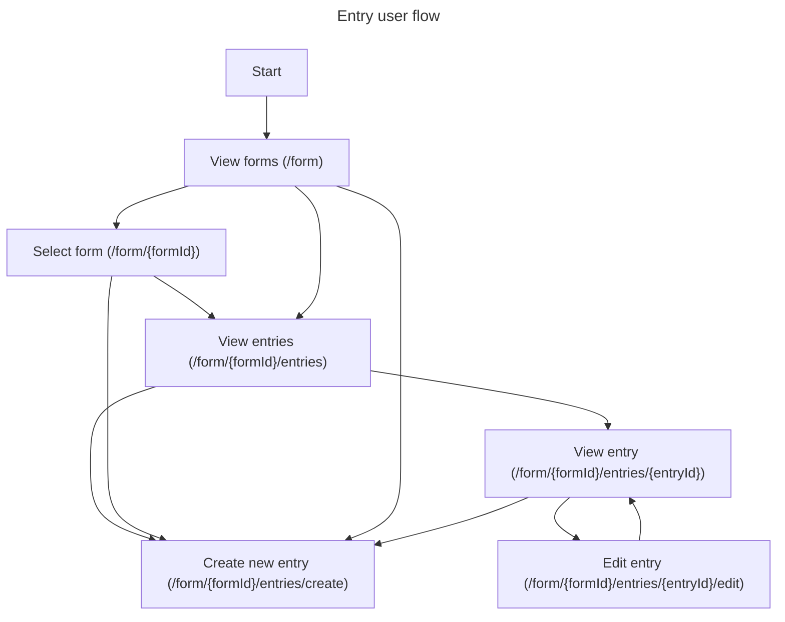

# Form - Field - Output Flowchart

```mermaid
---
title: Entry user flow
---
flowchart TD
  A[Start] --> B["View forms (/form)"]

  B --> C["Select form (/form/{formId})"]

  C --> D["View entries (/form/{formId}/entries)"]
  B --> D

  D --> G["Create new entry (/form/{formId}/entries/create)"]
  C --> G
  B --> G

  D --> E["View entry (/form/{formId}/entries/{entryId})"]
  E --> G

  E --> F["Edit entry (/form/{formId}/entries/{entryId}/edit)"] --> E
```
